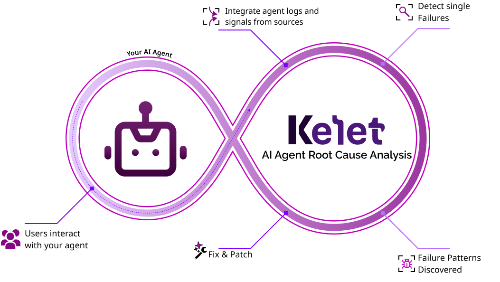

<div align="center">
  

  <h1>Automated Root Cause Analysis for AI Agents</h1>

  <p><strong>Agent failures take weeks to diagnose manually. Kelet runs 24/7 deep diagnosis and suggests targeted fixes.</strong></p>

  
</div>

Kelet analyzes production failures 24/7. Each trace takes 15-25 minutes to debug manually—finding patterns requires analyzing hundreds of traces. That's **weeks of engineering time** per root cause. Kelet does this automatically, surfacing issues like data imbalance, concept drift, prompt poisoning, and model laziness hidden in production noise.

---

## What Kelet Does

Kelet runs 24/7 analyzing every production trace:

1. **Captures** every interaction, user signal, and failure context automatically
2. **Analyzes** hundreds of failures in parallel to detect repeatable patterns
3. **Identifies** root causes (data issues, prompt problems, model behavior)
4. **Delivers** targeted fixes, not just dashboards

Unlike observability tools that show you data, Kelet analyzes it and tells you what to fix.

**Not magic**: Kelet is in alpha. Won't catch everything yet, needs your guidance sometimes. But it's already doing analysis that would take weeks manually.

Three lines of code to start.

## Installation

```bash
npm install kelet @opentelemetry/api @opentelemetry/sdk-trace-node @opentelemetry/exporter-trace-otlp-http
```

Or with your preferred package manager:

```bash
# pnpm
pnpm add kelet @opentelemetry/api @opentelemetry/sdk-trace-node @opentelemetry/exporter-trace-otlp-http

# yarn
yarn add kelet @opentelemetry/api @opentelemetry/sdk-trace-node @opentelemetry/exporter-trace-otlp-http

# bun (note: automatic reasoning capture not supported, see below)
bun add kelet @opentelemetry/api @opentelemetry/sdk-trace-node @opentelemetry/exporter-trace-otlp-http
```

For reasoning capture, also install the instrumentation package:
```bash
npm install @opentelemetry/instrumentation
```

Set your API key:

```bash
export KELET_API_KEY=your_api_key
export KELET_PROJECT=production  # Optional: organize traces by environment
```

Or configure in code:

```typescript
import { configure } from 'kelet';

configure({
  apiKey: 'your_api_key',
  project: 'production',  // Groups traces by project/environment
});
```

## Quick Start

### Node.js / General Setup

```typescript
import { configure } from 'kelet';

// Set up tracing (once at app startup)
// Creates exporter + span processor + provider automatically
configure({
  apiKey: process.env.KELET_API_KEY,
  project: 'production',
});
```

Works with any OpenTelemetry-instrumented framework or library.

If you already have a TracerProvider, pass it in:

```typescript
import { configure } from 'kelet';
import { NodeTracerProvider } from '@opentelemetry/sdk-trace-node';

const provider = new NodeTracerProvider();
provider.register();

configure({
  apiKey: process.env.KELET_API_KEY,
  project: 'production',
  tracerProvider: provider,
});
```

### Next.js Setup

**1. Install dependencies:**

```bash
npm install kelet @vercel/otel @opentelemetry/api @opentelemetry/exporter-trace-otlp-http
```

**2. Create `instrumentation.ts` in your project root:**

```typescript
import { registerOTel } from '@vercel/otel';
import { KeletExporter } from 'kelet';

export function register() {
  registerOTel({
    serviceName: 'my-app',
    traceExporter: new KeletExporter({
      apiKey: process.env.KELET_API_KEY,
      project: 'production',
    }),
  });
}
```

**3. Enable instrumentation in `next.config.js`:**

```javascript
/** @type {import('next').NextConfig} */
const nextConfig = {
  experimental: {
    instrumentationHook: true,
  },
};

module.exports = nextConfig;
```

### Vercel AI SDK

Enable telemetry in your AI SDK calls:

```typescript
import { generateText } from 'ai';
import { openai } from '@ai-sdk/openai';

const result = await generateText({
  model: openai('gpt-4'),
  prompt: 'Book a flight to NYC',
  experimental_telemetry: {
    isEnabled: true,
    metadata: {
      userId: 'user-123',
      sessionId: 'session-456',
    },
  },
});
```

### Capturing User Feedback

```typescript
import { signal, SignalKind, SignalSource } from 'kelet';

// Capture explicit user feedback
await signal({
  kind: SignalKind.FEEDBACK,
  source: SignalSource.HUMAN,
  sessionId: 'user-123-session',
  score: 0.0,  // User unhappy? Kelet analyzes why.
  value: 'Response was incorrect',
  triggerName: 'thumbs_down',
});

// Capture metric signals
await signal({
  kind: SignalKind.METRIC,
  source: SignalSource.SYNTHETIC,
  traceId: 'trace-abc-123',
  triggerName: 'accuracy',
  score: 0.85,
});
```

**That's it.** Kelet now runs 24/7 analyzing every trace, clustering failure patterns, and identifying root causes—work that would take weeks manually.

### Session Grouping

Use `agenticSession` to group spans and signals under a session/user. All spans created and `signal()` calls made inside the callback automatically inherit the session context.

```typescript
import { configure, agenticSession, signal, SignalKind, SignalSource } from 'kelet';

// configure() sets up the exporter + KeletSpanProcessor + provider
configure({
  apiKey: process.env.KELET_API_KEY,
  project: 'my-project',
});

// Group work under a session
await agenticSession({ sessionId: 'sess-123', userId: 'user-1' }, async () => {
  // All spans created here get gen_ai.conversation.id + user.id attributes
  // signal() auto-resolves sessionId from context — no need to pass it explicitly
  await signal({ kind: SignalKind.FEEDBACK, source: SignalSource.HUMAN, score: 1.0 });
});
```

`configure()` automatically wires a `KeletSpanProcessor` that stamps `kelet.project`, `gen_ai.conversation.id`, and `user.id` on every span. Inside `agenticSession`, `signal()` automatically picks up the `sessionId` — no need to pass it explicitly.

### Easy Feedback UI for React

Building a React frontend? Use the [Kelet Feedback UI](https://github.com/kelet-ai/feedback-ui) component for instant implicit and explicit feedback collection.
See the [live demo](https://feedback-ui.kelet.ai/) and [documentation](https://github.com/kelet-ai/feedback-ui) for full integration guide.

---

## What Gets Captured

Kelet is built on [OpenTelemetry](https://opentelemetry.io/) and supports multiple semantic conventions for AI/LLM observability:

| Semantic Convention | Supported Frameworks |
|---------------------|----------------------|
| [GenAI Semantic Conventions](https://opentelemetry.io/docs/specs/semconv/gen-ai/) | Pydantic AI, LiteLLM, Langfuse SDK |
| Vercel AI SDK | Next.js, Vercel AI |
| OpenInference | Arize Phoenix |
| OpenLLMetry / Traceloop | LangChain, LangGraph, LlamaIndex, OpenAI SDK, Anthropic SDK |

Any framework that exports OpenTelemetry traces using the GenAI semantic conventions will work automatically.

**Captured data includes:**

- **LLM calls**: Model, provider, tokens, latency, errors
- **Agent sessions**: Multi-step interactions grouped by user session
- **Custom context**: User IDs, session metadata, business-specific attributes

Works with any OpenTelemetry-compatible AI framework out of the box.

---

## Reasoning Capture for Vercel AI SDK

Vercel AI SDK's telemetry currently doesn't include reasoning/thinking content in spans ([vercel/ai#8823](https://github.com/vercel/ai/issues/8823)). Until an official fix, you can use this hook to capture reasoning from models that support extended thinking (like Claude with `reasoningConfig`).

### Prerequisites

The reasoning hook requires these peer dependencies:

```bash
npm install @opentelemetry/instrumentation @opentelemetry/sdk-trace-base @opentelemetry/sdk-trace-node
```

### Node.js (Recommended)

The automatic hook works with Node.js 18.19+ using ESM loaders:

```bash
# JavaScript
node --import kelet/reasoning/register app.js

# TypeScript (using tsx)
npx tsx --import kelet/reasoning/register app.ts
```

The hook intercepts AI SDK's `generateText` and `streamText` functions using `import-in-the-middle`. When a response includes reasoning, it's captured as span attributes:
- `ai.response.reasoning` - the full reasoning text
- `ai.reasoning.length` - character count

### Bun (or Alternative Import Approach)

> **Note:** Bun does not support automatic module interception ([bun#3775](https://github.com/oven-sh/bun/issues/3775)). Use the `kelet/aisdk` import instead.

Simply change your import from `'ai'` to `'kelet/aisdk'`:

```typescript
// Change this:
import { generateText, streamText } from 'ai';

// To this:
import { generateText, streamText, wrapExporter } from 'kelet/aisdk';
```

Then wrap your exporter in your OTEL setup (one-time):

```typescript
import { wrapExporter } from 'kelet/aisdk';
import { NodeTracerProvider, SimpleSpanProcessor } from '@opentelemetry/sdk-trace-node';
import { KeletExporter } from 'kelet';

const provider = new NodeTracerProvider();
const exporter = new KeletExporter({ apiKey: process.env.KELET_API_KEY });

// Wrap exporter to allow reasoning capture before export
provider.addSpanProcessor(new SimpleSpanProcessor(wrapExporter(exporter)));
provider.register();
```

That's it! Reasoning will be captured automatically.

**Alternative: Use Node.js via tsx** for fully automatic instrumentation (no code changes):
```bash
npx tsx --import kelet/reasoning/register app.ts
```

---

## Configuration

Set via environment variables:

```bash
export KELET_API_KEY=your_api_key    # Required
export KELET_PROJECT=production      # Optional, defaults to "default"
export KELET_API_URL=https://...     # Optional, defaults to api.kelet.ai
```

Or pass directly to the exporter:

```typescript
import { KeletExporter } from 'kelet';

const exporter = new KeletExporter({
  apiKey: 'your_api_key',
  project: 'production',
  apiUrl: 'https://custom.api.kelet.ai',  // Optional
});
```

## API Reference

### KeletExporter

OpenTelemetry trace exporter for sending traces to Kelet.

```typescript
import { KeletExporter } from 'kelet';
import { NodeSDK } from '@opentelemetry/sdk-node';

const exporter = new KeletExporter({
  apiKey?: string,     // KELET_API_KEY env var if not provided
  project?: string,    // defaults to "default"
  apiUrl?: string,     // defaults to "https://api.kelet.ai"
});

const sdk = new NodeSDK({ traceExporter: exporter });
sdk.start();
```

### signal()

Capture signals for AI responses. Inside `agenticSession()`, `sessionId` and `traceId` are resolved automatically from context.

```typescript
import { signal, SignalKind, SignalSource } from 'kelet';

await signal({
  kind: SignalKind.FEEDBACK,       // feedback | edit | event | metric | arbitrary
  source: SignalSource.HUMAN,      // human | label | synthetic
  sessionId?: string,              // Auto-resolved from agenticSession, or pass explicitly
  traceId?: string,                // Auto-resolved from active span, or pass explicitly
  triggerName?: string,            // e.g., "thumbs_down", "user_copy"
  score?: number,                  // 0.0 to 1.0
  value?: string,                  // Text content
  confidence?: number,             // 0.0 to 1.0
  metadata?: Record<string, unknown>,  // Additional metadata
  timestamp?: Date | string,       // Event timestamp
});
```

### agenticSession()

Group spans and signals under a session/user context.

```typescript
import { agenticSession } from 'kelet';

await agenticSession({
  sessionId: string,   // Required: session identifier
  userId?: string,     // Optional: user identifier
}, async () => {
  // All spans and signals inside inherit session context
});
```

### KeletSpanProcessor

SpanProcessor that stamps `kelet.project`, session, and user attributes on every span. Used automatically by `configure()` — only needed for manual OTEL setups.

```typescript
import { KeletSpanProcessor } from 'kelet';
import { SimpleSpanProcessor } from '@opentelemetry/sdk-trace-base';

const processor = new KeletSpanProcessor(
  new SimpleSpanProcessor(exporter),
  { project: 'my-project' }
);
```

### Context Helpers

```typescript
import { getSessionId, getUserId, getTraceId } from 'kelet';

getSessionId()  // Current session ID from agenticSession, or undefined
getUserId()     // Current user ID from agenticSession, or undefined
getTraceId()    // Current trace ID from active OpenTelemetry span, or undefined
```

### configure()

Configure the SDK and set up the OTEL tracing pipeline. Creates an exporter, `KeletSpanProcessor`, and TracerProvider automatically.

```typescript
import { configure } from 'kelet';

configure({
  apiKey?: string,              // KELET_API_KEY env var if not provided
  project?: string,             // defaults to "default"
  apiUrl?: string,              // defaults to "https://api.kelet.ai"
  tracerProvider?: BasicTracerProvider,  // Optional: use existing provider
});
```

### Types

```typescript
// Signal kind enum
const SignalKind = {
  FEEDBACK: 'feedback',   // User feedback (ratings, thumbs)
  EDIT: 'edit',            // User edited AI output
  EVENT: 'event',          // System/app event
  METRIC: 'metric',        // Numeric measurement
  ARBITRARY: 'arbitrary',  // Custom signal
} as const;

// Signal source enum
const SignalSource = {
  HUMAN: 'human',          // From a human user
  LABEL: 'label',          // From labeling process
  SYNTHETIC: 'synthetic',  // Synthetically generated
} as const;
```

---

## Production-Ready

The SDK never disrupts your application:

- **Async**: Telemetry exports in background, zero blocking
- **Fail-safe**: Network errors handled with retries and exponential backoff
- **Graceful**: If Kelet is down, your agent keeps running
- **Standard**: Built on OpenTelemetry, works with any OTEL-compatible setup

---

## Alpha Status

Kelet is in alpha. What this means:

- **It works**: Already analyzing thousands of production traces for early users
- **Not perfect**: Won't catch every failure pattern yet, sometimes needs guidance
- **Improving fast**: The AI learns from more production data every day
- **We need feedback**: Help us make it better—tell us what it catches and what it misses

Even in alpha, Kelet does analysis that would take your team weeks to do manually.

**The alternative?** Manually analyzing 15-25 minutes per trace, across hundreds of failures, trying to spot patterns by hand. Most teams just don't do it—and ship broken agents.

---

## Learn More

- **Website**: [kelet.ai](https://kelet.ai)
- **Early Access**: We're onboarding teams with production AI agents
- **Support**: [GitHub Issues](https://github.com/Kelet-ai/typescript-sdk/issues)

Built for teams shipping mission-critical AI agents.
